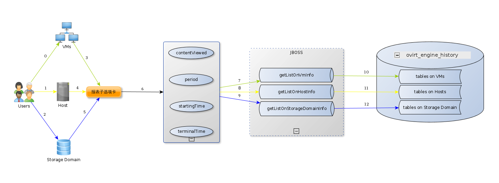

# 设计文档之报表

* 该功能采用了三层模式架构，分别为：模型层，视图层和逻辑结构层。采用由下子上的方法开发，所以先从数据库开始。

* 数据库
  * 使用的是开源 `postgresql` 数据库，该项目使用的是 `ovirt_engine_history` 数据库。
  * 这里使用到的表共有 20 个。
  * 表结构：
    1. 用于获取某一天内某一个小时的虚拟机 CPU 和内存使用率的 `vm-samples_histoy` 表。
       ~~~ bash
															  Table "public.vm_samples_history"
							 Column               |           Type           |                       Modifiers                       
		 ------------------------------------+--------------------------+-------------------------------------------------------
		  history_id                         | bigint                   | not null default nextval('vm_history_seq1'::regclass)
		  history_datetime                   | timestamp with time zone | not null
		  vm_id                              | uuid                     | not null
		  vm_status                          | smallint                 | not null
		  minutes_in_status                  | numeric(7,2)             | not null default 1
		  cpu_usage_percent                  | smallint                 | default 0
		  memory_usage_percent               | smallint                 | default 0
		  vm_ip                              | text                     | 
		  current_user_name                  | character varying(255)   | 
		  currently_running_on_host          | uuid                     | 
		  vm_configuration_version           | integer                  | 
		  current_host_configuration_version | integer                  | 
		  vm_client_ip                       | character varying(255)   | 
		  user_logged_in_to_guest            | boolean                  | 
		  user_cpu_usage_percent             | smallint                 | 
		  system_cpu_usage_percent           | smallint                 | 
		  current_user_id                    | uuid                     | 
       ~~~
    
    2. 用于获取某天的某几个小时内的虚拟机 CPU 和内存使用率的 `vm_hourly_history` 表。
       ~~~ bash
															  Table "public.vm_hourly_history"
							 Column               |           Type           |                       Modifiers                       
		 ------------------------------------+--------------------------+-------------------------------------------------------
		  history_id                         | bigint                   | not null default nextval('vm_history_seq2'::regclass)
		  history_datetime                   | timestamp with time zone | not null
		  vm_id                              | uuid                     | not null
		  vm_status                          | smallint                 | not null
		  minutes_in_status                  | numeric(7,2)             | not null default 1
		  cpu_usage_percent                  | smallint                 | default 0
		  max_cpu_usage                      | smallint                 | 
		  memory_usage_percent               | smallint                 | default 0
		  max_memory_usage                   | smallint                 | 
		  vm_ip                              | text                     | 
		  current_user_name                  | character varying(255)   | 
		  currently_running_on_host          | uuid                     | 
		  vm_configuration_version           | integer                  | 
		  current_host_configuration_version | integer                  | 
		  user_cpu_usage_percent             | smallint                 | 
		  max_user_cpu_usage_percent         | smallint                 | 
		  system_cpu_usage_percent           | smallint                 | 
		  max_system_cpu_usage_percent       | smallint                 | 
		  current_user_id                    | uuid                     | 
       ~~~

    3. 用于获取某一周，某个月，某个季度以及某年的虚拟机 CPU 和内存使用率的 `vm_yearly_history` 表。
       ~~~ bash
															  Table "public.vm_daily_history"
							 Column               |          Type          |                       Modifiers                       
		 ------------------------------------+------------------------+-------------------------------------------------------
		  history_id                         | bigint                 | not null default nextval('vm_history_seq3'::regclass)
		  history_datetime                   | date                   | not null
		  vm_id                              | uuid                   | not null
		  vm_status                          | smallint               | not null
		  minutes_in_status                  | numeric(7,2)           | not null default 1
		  cpu_usage_percent                  | smallint               | default 0
		  max_cpu_usage                      | smallint               | 
		  memory_usage_percent               | smallint               | default 0
		  max_memory_usage                   | smallint               | 
		  vm_ip                              | text                   | 
		  current_user_name                  | character varying(255) | 
		  currently_running_on_host          | uuid                   | 
		  vm_configuration_version           | integer                | 
		  current_host_configuration_version | integer                | 
		  user_cpu_usage_percent             | smallint               | 
		  max_user_cpu_usage_percent         | smallint               | 
		  system_cpu_usage_percent           | smallint               | 
		  max_system_cpu_usage_percent       | smallint               | 
		  current_user_id                    | uuid                   | 
       ~~~

    4. 用于获取某一天内某一个小时内虚拟机网络接口传入/传出速率的 `vm_interface_samples_history` 表。
       ~~~ bash
			                                      Table "public.vm_interface_samples_history"
							 Column               |           Type           |                            Modifiers                            
		 ------------------------------------+--------------------------+-----------------------------------------------------------------
		  history_id                         | integer                  | not null default nextval('vm_interface_history_seq1'::regclass)
		  history_datetime                   | timestamp with time zone | not null
		  vm_interface_id                    | uuid                     | not null
		  receive_rate_percent               | smallint                 | 
		  transmit_rate_percent              | smallint                 | 
		  vm_interface_configuration_version | integer                  | 
       ~~~

    5. 用于获取某天中某几个小时内虚拟机网络接口传入/传出速率的 `vm_interface_hourly_history` 表。
       ~~~ bash
															  Table "public.vm_interface_hourly_history"
							 Column               |           Type           |                            Modifiers                            
		 ------------------------------------+--------------------------+-----------------------------------------------------------------
		  history_id                         | integer                  | not null default nextval('vm_interface_history_seq2'::regclass)
		  history_datetime                   | timestamp with time zone | not null
		  vm_interface_id                    | uuid                     | not null
		  receive_rate_percent               | smallint                 | 
		  max_receive_rate_percent           | smallint                 | 
		  transmit_rate_percent              | smallint                 | 
		  max_transmit_rate_percent          | smallint                 | 
		  vm_interface_configuration_version | integer                  | 
       ~~~

    6. 用于获取某一周，某个月，某个季度以及某年的虚拟机网络接口传入/传出速率的 `vm_interface_daily_history` 表。
       ~~~ bash
          												  Table "public.vm_interface_daily_history"
							 Column               |   Type   |                            Modifiers                            
		 ------------------------------------+----------+-----------------------------------------------------------------
		  history_id                         | integer  | not null default nextval('vm_interface_history_seq3'::regclass)
		  history_datetime                   | date     | not null
		  vm_interface_id                    | uuid     | not null
		  receive_rate_percent               | smallint | 
		  max_receive_rate_percent           | smallint | 
		  transmit_rate_percent              | smallint | 
		  max_transmit_rate_percent          | smallint | 
		  vm_interface_configuration_version | integer  | 
		 ~~~

    7. 用于获取某一个小时内虚拟机磁盘使用率的 `vm_disk_samples_history` 表。
       ~~~ bash
														Table "public.vm_disk_samples_history"
						 Column             |           Type           |                         Modifiers                          
		 -------------------------------+--------------------------+------------------------------------------------------------
		  history_id                    | bigint                   | not null default nextval('vm_disk_history_seq1'::regclass)
		  history_datetime              | timestamp with time zone | not null
		  image_id                      | uuid                     | 
		  vm_disk_status                | smallint                 | 
		  minutes_in_status             | numeric(7,2)             | not null default 1
		  vm_disk_actual_size_mb        | integer                  | not null
		  read_rate_bytes_per_second    | integer                  | 
		  read_latency_seconds          | numeric(18,9)            | 
		  write_rate_bytes_per_second   | integer                  | 
		  write_latency_seconds         | numeric(18,9)            | 
		  flush_latency_seconds         | numeric(18,9)            | 
		  vm_disk_configuration_version | integer                  | 
		  vm_disk_id                    | uuid                     | not null
		 ~~~
  
    8. 用于获取某一天内某几个小时虚拟机磁盘使用率的 `vm_disk_hourly_history` 表。
       ~~~ bash
														  Table "public.vm_disk_hourly_history"
						  Column              |           Type           |                         Modifiers                          
		 ---------------------------------+--------------------------+------------------------------------------------------------
		  history_id                      | bigint                   | not null default nextval('vm_disk_history_seq2'::regclass)
		  history_datetime                | timestamp with time zone | not null
		  image_id                        | uuid                     | 
		  vm_disk_status                  | smallint                 | 
		  minutes_in_status               | numeric(7,2)             | not null default 1
		  vm_disk_actual_size_mb          | integer                  | not null
		  read_rate_bytes_per_second      | integer                  | 
		  max_read_rate_bytes_per_second  | integer                  | 
		  read_latency_seconds            | numeric(18,9)            | 
		  max_read_latency_seconds        | numeric(18,9)            | 
		  write_rate_bytes_per_second     | integer                  | 
		  max_write_rate_bytes_per_second | integer                  | 
		  write_latency_seconds           | numeric(18,9)            | 
		  max_write_latency_seconds       | numeric(18,9)            | 
		  flush_latency_seconds           | numeric(18,9)            | 
		  max_flush_latency_seconds       | numeric(18,9)            | 
		  vm_disk_configuration_version   | integer                  | 
		  vm_disk_id                      | uuid                     | not null
		 ~~~
    
    9. 用于获取某一周，某个月，某个解读以及某年的虚拟机磁盘使用率的 `vm_disk_daily_history` 表。
       ~~~ bash
														  Table "public.vm_disk_daily_history"
						  Column              |     Type      |                         Modifiers                          
		 ---------------------------------+---------------+------------------------------------------------------------
		  history_id                      | bigint        | not null default nextval('vm_disk_history_seq3'::regclass)
		  history_datetime                | date          | not null
		  image_id                        | uuid          | 
		  vm_disk_status                  | smallint      | 
		  minutes_in_status               | numeric(7,2)  | not null default 1
		  vm_disk_actual_size_mb          | integer       | not null
		  read_rate_bytes_per_second      | integer       | 
		  max_read_rate_bytes_per_second  | integer       | 
		  read_latency_seconds            | numeric(18,9) | 
		  max_read_latency_seconds        | numeric(18,9) | 
		  write_rate_bytes_per_second     | integer       | 
		  max_write_rate_bytes_per_second | integer       | 
		  write_latency_seconds           | numeric(18,9) | 
		  max_write_latency_seconds       | numeric(18,9) | 
		  flush_latency_seconds           | numeric(18,9) | 
		  max_flush_latency_seconds       | numeric(18,9) | 
		  vm_disk_configuration_version   | integer       | 
		  vm_disk_id                      | uuid          | not null
		 ~~~
   
    10. 用于获取某一天内某一个小时内的主机 CPU 以及内存的使用率的 `host_samples_history` 表。

        ~~~ bash
															  Table "public.host_samples_history"
						 Column           |           Type           |                        Modifiers                        
		  ----------------------------+--------------------------+---------------------------------------------------------
			history_id                 | bigint                   | not null default nextval('host_history_seq1'::regclass)
			history_datetime           | timestamp with time zone | not null
			host_id                    | uuid                     | not null
			host_status                | smallint                 | not null
			minutes_in_status          | numeric(7,2)             | not null default 1
			memory_usage_percent       | smallint                 | default 0
			cpu_usage_percent          | smallint                 | 
			ksm_cpu_percent            | smallint                 | default 0
			active_vms                 | smallint                 | default 0
			total_vms                  | smallint                 | default 0
			total_vms_vcpus            | integer                  | default 0
			cpu_load                   | integer                  | default 0
			system_cpu_usage_percent   | smallint                 | default 0
			user_cpu_usage_percent     | smallint                 | default 0
			swap_used_mb               | integer                  | 
			host_configuration_version | integer                  | 
			ksm_shared_memory_mb       | bigint                   | 
		  ~~~

    11. 用于获取某一天内某几个小时的主机 CPU 以及内存使用率的 `host_hourly_history` 表。
        ~~~ bash
                                          Table "public.host_hourly_history"
						  Column            |           Type           |                        Modifiers                        
		  ------------------------------+--------------------------+---------------------------------------------------------
			history_id                   | bigint                   | not null default nextval('host_history_seq2'::regclass)
			history_datetime             | timestamp with time zone | not null
			host_id                      | uuid                     | not null
			host_status                  | smallint                 | not null
			minutes_in_status            | numeric(7,2)             | not null default 1
			memory_usage_percent         | smallint                 | default 0
			max_memory_usage             | smallint                 | 
			cpu_usage_percent            | smallint                 | 
			max_cpu_usage                | smallint                 | 
			ksm_cpu_percent              | smallint                 | default 0
			max_ksm_cpu_percent          | smallint                 | default 0
			active_vms                   | smallint                 | default 0
			max_active_vms               | smallint                 | default 0
			total_vms                    | smallint                 | default 0
			max_total_vms                | smallint                 | default 0
			total_vms_vcpus              | integer                  | default 0
			max_total_vms_vcpus          | integer                  | default 0
			cpu_load                     | integer                  | default 0
			max_cpu_load                 | integer                  | default 0
			system_cpu_usage_percent     | smallint                 | default 0
			max_system_cpu_usage_percent | smallint                 | default 0
			user_cpu_usage_percent       | smallint                 | default 0
			max_user_cpu_usage_percent   | smallint                 | default 0
			swap_used_mb                 | integer                  | 
			max_swap_used_mb             | integer                  | 
			host_configuration_version   | integer                  | 
			ksm_shared_memory_mb         | bigint                   | 
			max_ksm_shared_memory_mb     | bigint                   | 
        ~~~

    12. 用于获取某一周，某个月，某个季度以及某年的主机 CPU 以及内存使用率的 `host_daily_history` 表。
        ~~~ bash
                                   Table "public.host_daily_history"
						  Column            |     Type     |                        Modifiers                        
		  ------------------------------+--------------+---------------------------------------------------------
			history_id                   | bigint       | not null default nextval('host_history_seq3'::regclass)
			history_datetime             | date         | not null
			host_id                      | uuid         | not null
			host_status                  | smallint     | not null
			minutes_in_status            | numeric(7,2) | not null default 1
			memory_usage_percent         | smallint     | default 0
			max_memory_usage             | smallint     | 
			cpu_usage_percent            | smallint     | 
			max_cpu_usage                | smallint     | 
			ksm_cpu_percent              | smallint     | default 0
			max_ksm_cpu_percent          | smallint     | default 0
			active_vms                   | smallint     | default 0
			max_active_vms               | smallint     | default 0
			total_vms                    | smallint     | default 0
			max_total_vms                | smallint     | default 0
			total_vms_vcpus              | integer      | default 0
			max_total_vms_vcpus          | integer      | default 0
			cpu_load                     | integer      | default 0
			max_cpu_load                 | integer      | default 0
			system_cpu_usage_percent     | smallint     | default 0
			max_system_cpu_usage_percent | smallint     | default 0
			user_cpu_usage_percent       | smallint     | default 0
			max_user_cpu_usage_percent   | smallint     | default 0
			swap_used_mb                 | integer      | 
			max_swap_used_mb             | integer      | 
			host_configuration_version   | integer      | 
			ksm_shared_memory_mb         | bigint       | 
			max_ksm_shared_memory_mb     | bigint       | 
		  ~~~

    13. 用于获取某天内的某一个小时的主机网络接口传入/传出速率的 `host_interface_samples_history` 表。
        ~~~ bash
                                            Table "public.host_interface_samples_history"
								Column                |           Type           |                             Modifiers                             
		  --------------------------------------+--------------------------+-------------------------------------------------------------------
			history_id                           | bigint                   | not null default nextval('host_interface_history_seq1'::regclass)
			history_datetime                     | timestamp with time zone | not null
			host_interface_id                    | uuid                     | not null
			receive_rate_percent                 | smallint                 | 
			transmit_rate_percent                | smallint                 | 
			host_interface_configuration_version | integer                  | 
		  ~~~
     
    14. 用于获取某天内某几个小时的主机网络接口传入/传出速率的 `host_interface_hourly_history` 表。
        ~~~ bash
                                            Table "public.host_interface_hourly_history"
								Column                |           Type           |                             Modifiers                             
		  --------------------------------------+--------------------------+-------------------------------------------------------------------
			history_id                           | bigint                   | not null default nextval('host_interface_history_seq2'::regclass)
			history_datetime                     | timestamp with time zone | not null
			host_interface_id                    | uuid                     | not null
			receive_rate_percent                 | smallint                 | 
			max_receive_rate_percent             | smallint                 | 
			transmit_rate_percent                | smallint                 | 
			max_transmit_rate_percent            | smallint                 | 
			host_interface_configuration_version | integer                  | 
		  ~~~
  
    15. 用于获取某一周，某个月，某个季度以及某年的主机网络接口传入/传出速率的 `host_interface_daily_history` 表。
        ~~~ bash
                                     Table "public.host_interface_daily_history"
								Column                |   Type   |                             Modifiers                             
		  --------------------------------------+----------+-------------------------------------------------------------------
			history_id                           | bigint   | not null default nextval('host_interface_history_seq3'::regclass)
			history_datetime                     | date     | not null
			host_interface_id                    | uuid     | not null
			receive_rate_percent                 | smallint | 
			max_receive_rate_percent             | smallint | 
			transmit_rate_percent                | smallint | 
			max_transmit_rate_percent            | smallint | 
			host_interface_configuration_version | integer  | 
		  ~~~

    16. 用于获取某天内某一个小时的存储域的各个磁盘的使用率的 `storage_domain_samples_history` 表。
        ~~~ bash
                                        Table "public.storage_domain_samples_history"
						  Column             |           Type           |                             Modifiers                             
		  -------------------------------+--------------------------+-------------------------------------------------------------------
			history_id                    | bigint                   | not null default nextval('storage_domain_history_seq1'::regclass)
			history_datetime              | timestamp with time zone | not null
			storage_domain_id             | uuid                     | not null
			available_disk_size_gb        | integer                  | 
			used_disk_size_gb             | integer                  | 
			storage_configuration_version | integer                  | 
			storage_domain_status         | smallint                 | not null default 1
			minutes_in_status             | numeric(7,2)             | not null default 1
		  ~~~

    17. 用于获取某天内某几个小时的存储域的各个磁盘的使用率 `storage_domain_hourly_history` 表。
        ~~~ bash
                                                 Table "public.storage_domain_hourly_history"
						  Column             |           Type           |                             Modifiers                             
		  -------------------------------+--------------------------+-------------------------------------------------------------------
			history_id                    | bigint                   | not null default nextval('storage_domain_history_seq2'::regclass)
			history_datetime              | timestamp with time zone | not null
			storage_domain_id             | uuid                     | not null
			available_disk_size_gb        | integer                  | 
			used_disk_size_gb             | integer                  | 
			storage_configuration_version | integer                  | 
			storage_domain_status         | smallint                 | not null default 1
			minutes_in_status             | numeric(7,2)             | not null default 1
		  ~~~

    18. 用于获取某一周，某个月，某个季度以及某年的存储域各个磁盘使用率的 `storage_domain_daily_history` 表。
        ~~~ bash
                                   Table "public.storage_domain_daily_history"
						  Column             |     Type     |                             Modifiers                             
		  -------------------------------+--------------+-------------------------------------------------------------------
			history_id                    | bigint       | not null default nextval('storage_domain_history_seq3'::regclass)
			history_datetime              | date         | not null
			storage_domain_id             | uuid         | not null
			available_disk_size_gb        | integer      | 
			used_disk_size_gb             | integer      | 
			storage_configuration_version | integer      | 
			storage_domain_status         | smallint     | not null default 1
			minutes_in_status             | numeric(7,2) | not null default 1
		  ~~~

    19. 用于通过虚拟机 ID 获取到该虚拟机上虚拟网卡 ID 的 `vm_interface_configuration` 表。
        ~~~ bash
                                   Table "public.vm_interface_configuration"
						Column          |           Type           |                        Modifiers                        
		  --------------------------+--------------------------+---------------------------------------------------------
			history_id               | integer                  | not null default nextval('configuration_seq'::regclass)
			vm_interface_id          | uuid                     | not null
			vm_interface_name        | character varying(50)    | not null
			vm_id                    | uuid                     | 
			vm_interface_type        | smallint                 | 
			vm_interface_speed_bps   | integer                  | 
			mac_address              | character varying(20)    | 
			logical_network_name     | character varying(50)    | 
			vm_configuration_version | integer                  | 
			create_date              | timestamp with time zone | 
			update_date              | timestamp with time zone | 
			delete_date              | timestamp with time zone | 
		  ~~~

    20. 用于通过主机 ID 获取到主机网卡 ID 的 `host_interface_configuration` 表。
        ~~~ bash
                                   Table "public.host_interface_configuration"
						 Column           |           Type           |                        Modifiers                        
		  ----------------------------+--------------------------+---------------------------------------------------------
			history_id                 | integer                  | not null default nextval('configuration_seq'::regclass)
			host_interface_id          | uuid                     | not null
			host_interface_name        | character varying(50)    | not null
			host_id                    | uuid                     | not null
			host_interface_type        | smallint                 | 
			host_interface_speed_bps   | integer                  | 
			mac_address                | character varying(59)    | 
			logical_network_name       | character varying(50)    | 
			ip_address                 | character varying(20)    | 
			gateway                    | character varying(20)    | 
			bond                       | boolean                  | 
			bond_name                  | character varying(50)    | 
			vlan_id                    | integer                  | 
			host_configuration_version | integer                  | 
			create_date                | timestamp with time zone | 
			update_date                | timestamp with time zone | 
			delete_date                | timestamp with time zone | 
		  ~~~

* 流程图
 
  
  
  * 流程解释：
     1. 0 ~ 2：用户可以通过浏览器选择 EayunOS 系统中的某一个虚拟机，主机或存储域。
     2. 3 ~ 5：点击虚拟机，主机或者存储域的报表子选项卡。这时用户可以看到报表界面，而前端也获得了被访问实体的 ID（vm_id, host_id, storage_domain_id）。
     3. 6：用户可以在报表界面中选择相应的查看对象（CPU，内存，网络接口，磁盘），查看周期（时，天，周，月，季度，年），具体时间（具体的某时，某天，某月等）。此时前端会将用户选择的数据以 GET 的方式发送到服务器端（JBOSS）。
     4. 7 ~ 9：服务器端接收到前端发送过来的数据后，会采取分流的方式将数据发送给相应的实体接口（例如：如果用户选择的是某个存储域，就会将数据发送给 getListOnStorageDomainInfo 接口）。
     5. 10 ~ 12：通过上面提到的接口，会调用相应的 DAO 类，将数据从数据库中提取出来。
     6. 这时前端就可以通过接口返回的数据，利用 chartjs 做出报表展示。

* 初步测试：

  * VM
    * CPU
      * HOUR
        ~~~ bash
        [zhangyaqi@localhost ~]$ curl -H "Accept: application/json" 192.168.9.56:8080/ovirt-engine-webadmin-reports/VMREPORTS/a744e7dd-2563-4919-909c-fc0d99d645e3?contentViewed=CPU\&period=DAY\&startingTime=2016-04-19%2002%3A00%3A00
        [{"cpu_usage_percent":0,"max_cpu_usage":0,"memory_usage_percent":0,"max_memory_usage":0},{"cpu_usage_percent":0,"max_cpu_usage":0,"memory_usage_percent":0,"max_memory_usage":0},{"cpu_usage_percent":0,"max_cpu_usage":0,"memory_usage_percent":0,"max_memory_usage":0},{"cpu_usage_percent":0,"max_cpu_usage":0,"memory_usage_percent":0,"max_memory_usage":0},{"cpu_usage_percent":0,"max_cpu_usage":0,"memory_usage_percent":0,"max_memory_usage":0},{"cpu_usage_percent":0,"max_cpu_usage":0,"memory_usage_percent":0,"max_memory_usage":0},{"cpu_usage_percent":0,"max_cpu_usage":0,"memory_usage_percent":0,"max_memory_usage":0},{"cpu_usage_percent":0,"max_cpu_usage":0,"memory_usage_percent":0,"max_memory_usage":0},{"cpu_usage_percent":0,"max_cpu_usage":0,"memory_usage_percent":0,"max_memory_usage":0},{"cpu_usage_percent":0,"max_cpu_usage":0,"memory_usage_percent":0,"max_memory_usage":0},{"cpu_usage_percent":0,"max_cpu_usage":0,"memory_usage_percent":0,"max_memory_usage":0},{"cpu_usage_percent":0,"max_cpu_usage":0,"memory_usage_percent":0,"max_memory_usage":0},{"cpu_usage_percent":0,"max_cpu_usage":1,"memory_usage_percent":0,"max_memory_usage":0}]
        ~~~
      * DAY
      * WEEK / MONTH / QUARTER / YEAR
    * Memory
      * HOUR
      * DAY
      * WEEK / MONTH / QUARTER / YEAR
    * Disks
    * Network

  * HOST
    * CPU
    * Memory
    * Network

  * Storage Domain
    * Disks
